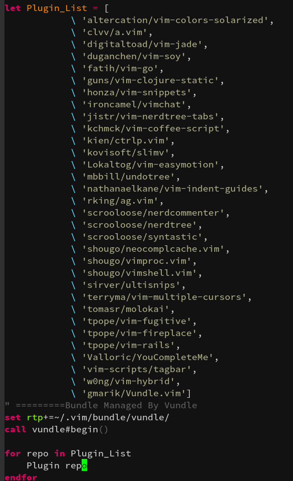

# VIM-Store
A Plugin Store for VIM, based on the plugin management provided by Vundle

To make something that can grab a list of repos' names and update the PluginList is the current idea.

# TODO:
Implement the VIM buffer view, the store sever, categories, entries
